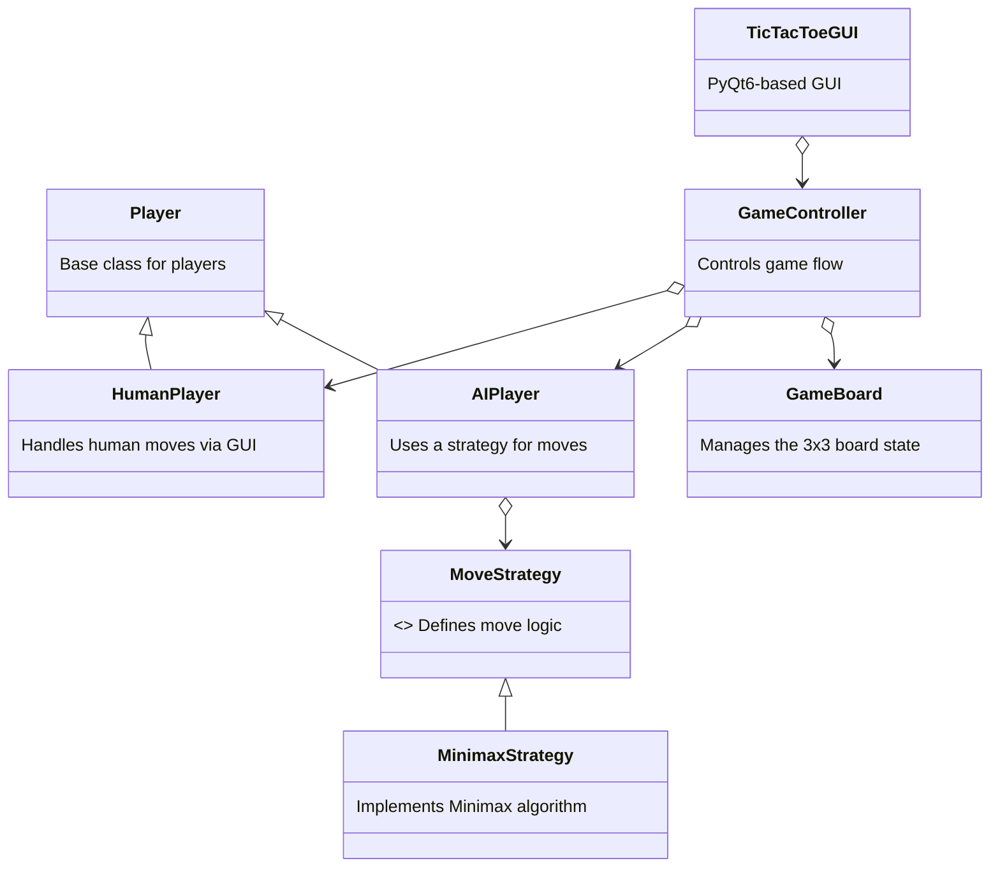
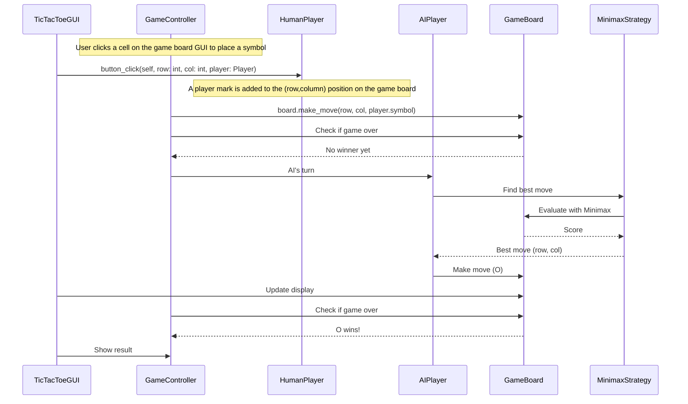

# Tic-Tac-Toe with Minimax Algorithm

Welcome to the **Tic-Tac-Toe** project! This is an educational coding challenge designed to teach you object-oriented programming (OOP), the Minimax algorithm, GUI development, and game logic using Python. Whether you're a beginner or looking to deepen your understanding, this README will guide you through every step.

---

## Project Overview

In this project, you’ll build a Tic-Tac-Toe game where:
- A human player (X) competes against an unbeatable AI (O).
- The AI uses the **Minimax algorithm** to make optimal moves.
- The game runs in a graphical user interface (GUI) built with **PyQt6**.
- The **Strategy Design Pattern** adds flexibility to swap AI algorithms.
- A **two-dimensional array** models the 3x3 game board.

### Learning Objectives
- Understand recursion and decision-making with Minimax.
- Learn how to structure code with classes and design patterns.
- Master GUI development with PyQt6.
- Visualize code and data structures using Mermaid diagrams.

---

## Prerequisites

### Software Requirements
- **Python 3.9+**: Download from [python.org](https://www.python.org/downloads/).
- **PyQt6**: Install via `pip install PyQt6` (compatible with macOS 12+, Windows, Linux).
- **IDE**: Use VS Code, PyCharm, or any text editor with Python support.
- **Git**: Optional, for version control.

### Knowledge Requirements
- Basic Python (variables, loops, functions).
- Familiarity with OOP concepts (classes, inheritance) is helpful but not required.

---

## Project Setup

1. **Create a New Project:**
   - Open your IDE and create a folder named `Tic-Tac-Toe`.
   - Initialize a Python environment (e.g., `python -m venv venv`).

2. **Install Dependencies:**
   ```bash
   pip install PyQt6
   ```

3. **File Structure:**
   - `game_board.py`: Board logic.
   - `player.py`: Base player class.
   - `human_player.py`: Human player logic.
   - `ai_player.py`: AI player logic.
   - `move_strategy.py`: Strategy pattern base.
   - `minimax_strategy.py`: Minimax algorithm.
   - `game_controller.py`: Game flow.
   - `gui.py`: PyQt6 GUI.
   - `main.py`: Entry point.

4. **Run the Game:**
   - Implement the classes (see class templates in your project files).
   - Run `python main.py` to start the game.

---

## Understanding the Minimax Algorithm

The **Minimax algorithm** is a recursive strategy for two-player games like Tic-Tac-Toe. It ensures the AI makes the best possible move by simulating all future game states.

### What is Minimax?
- A decision-making algorithm where:
  - The **maximizing player** (X) aims for the highest score.
  - The **minimizing player** (O, the AI) aims for the lowest score for X.
- It assumes both players play optimally, making the AI unbeatable.

### How Does It Work?
1. **Start at the Current State:** Look at the board as it is now.
2. **Explore All Moves:** For each empty cell, simulate a move.
3. **Recurse Until Game Ends:** Keep making moves until a win, loss, or draw.
4. **Score End States:**
   - **X wins:** `+10 - depth` (quicker wins = higher score).
   - **O wins:** `-10 + depth` (quicker wins = lower score).
   - **Draw:** `0`.
5. **Backtrack:**
   - Maximizing turn (X): Pick the highest score.
   - Minimizing turn (O): Pick the lowest score.
6. **Choose the Best Move:** The AI picks the move leading to the best outcome.

### Why Use Minimax?
- Guarantees an optimal strategy in zero-sum games.
- Teaches recursion, tree traversal, and optimization.

### Enhanced Visualizing Minimax

To provide a deeper understanding of the Minimax algorithm, let’s visualize it with a more exhaustive Mermaid diagram using a simplified 1x3 board scenario. This setup keeps the example manageable while comprehensively illustrating the algorithm’s decision-making process. Below, I’ll present a corrected and expanded diagram, followed by a detailed explanation.

#### Scenario Setup
- **Board:** A 1x3 grid (three cells in a row: `[_, _, _]`).
- **Players:** X (maximizing player) and O (minimizing player).
- **Win Condition:** Two in a row wins (adapted for this small board).
- **Scoring:** 
  - X wins: `10 - depth` (favoring quicker wins).
  - Draw: `0`.
  - O wins: `-10 + depth` (favoring quicker losses for X, though rare in this setup).
- **Depth:** Starts at 0 at the root, increases by 1 per move.

This simplified scenario focuses on the algorithm’s logic, making it easier to follow than a full 3x3 Tic-Tac-Toe board.

#### Mermaid Diagram for Minimax

Here’s an exhaustive Mermaid diagram showing the complete game tree for the 1x3 board. It traces all possible moves from the initial empty state, evaluates terminal states, and demonstrates how scores propagate back to the root. I’ve tested and corrected errors (e.g., missing transitions, inconsistent win conditions) to ensure accuracy.

```mermaid
graph TD
    A[Board: [_, _, _]<br>Turn: X<br>Depth: 0] -->|X in 0| B[Board: [X, _, _]<br>Turn: O<br>Depth: 1]
    A -->|X in 1| C[Board: [_, X, _]<br>Turn: O<br>Depth: 1]
    A -->|X in 2| D[Board: [_, _, X]<br>Turn: O<br>Depth: 1]
    
    B -->|O in 1| E[Board: [X, O, _]<br>Turn: X<br>Depth: 2]
    B -->|O in 2| F[Board: [X, _, O]<br>Turn: X<br>Depth: 2]
    
    C -->|O in 0| G[Board: [O, X, _]<br>Turn: X<br>Depth: 2]
    C -->|O in 2| H[Board: [_, X, O]<br>Turn: X<br>Depth: 2]
    
    D -->|O in 0| I[Board: [O, _, X]<br>Turn: X<br>Depth: 2]
    D -->|O in 1| J[Board: [_, O, X]<br>Turn: X<br>Depth: 2]
    
    E -->|X in 2| K[Board: [X, O, X]<br>Game Over<br>Depth: 3<br>Score: 0 (Draw)]
    
    F -->|X in 1| L[Board: [X, X, O]<br>Game Over<br>Depth: 3<br>Score: 10 - 3 = 7 (X wins)]
    
    G -->|X in 2| M[Board: [O, X, X]<br>Game Over<br>Depth: 3<br>Score: 10 - 3 = 7 (X wins)]
    
    H -->|X in 0| N[Board: [X, X, O]<br>Game Over<br>Depth: 3<br>Score: 10 - 3 = 7 (X wins)]
    
    I -->|X in 1| O[Board: [O, X, X]<br>Game Over<br>Depth: 3<br>Score: 10 - 3 = 7 (X wins)]
    
    J -->|X in 0| P[Board: [X, O, X]<br>Game Over<br>Depth: 3<br>Score: 0 (Draw)]
    
    E --> Q[Min: 0]
    F --> R[Min: 7]
    B --> S[Max: 7]
    
    G --> T[Min: 7]
    H --> U[Min: 7]
    C --> V[Max: 7]
    
    I --> W[Min: 7]
    J --> X[Min: 0]
    D --> Y[Max: 7]
    
    A --> Z[Minimax: 7]
```

#### Explanation of the Diagram

Let’s break down how the Minimax algorithm evaluates this game tree step-by-step, ensuring clarity and depth in the explanation.

1. **Initial State (Root Node A):**
   - **Board:** `[_, _, _]`
   - **Turn:** X (maximizing player)
   - **Depth:** 0
   - X has three possible moves: placing an X in position 0, 1, or 2. Each leads to a new board state (B, C, D).

2. **X’s First Move (Depth 1):**
   - **Move to B:** `[X, _, _]`, O’s turn.
   - **Move to C:** `[_, X, _]`, O’s turn.
   - **Move to D:** `[_, _, X]`, O’s turn.
   - Since no player has won yet (no two in a row), the game continues.

3. **O’s Response (Depth 2):**
   - **From B ([X, _, _]):**
     - O in 1 → E: `[X, O, _]`
     - O in 2 → F: `[X, _, O]`
   - **From C ([_, X, _]):**
     - O in 0 → G: `[O, X, _]`
     - O in 2 → H: `[_, X, O]`
   - **From D ([_, _, X]):**
     - O in 0 → I: `[O, _, X]`
     - O in 1 → J: `[_, O, X]`
   - O (minimizing) aims to reduce X’s score, but no single O move wins here (two in a row isn’t possible for O yet).

4. **X’s Second Move (Depth 3, Terminal States):**
   - **From E ([X, O, _]):**
     - X in 2 → K: `[X, O, X]`, a draw (no two in a row, board full). Score: `0`.
   - **From F ([X, _, O]):**
     - X in 1 → L: `[X, X, O]`, X wins (two X’s in a row). Score: `10 - 3 = 7`.
   - **From G ([O, X, _]):**
     - X in 2 → M: `[O, X, X]`, X wins. Score: `10 - 3 = 7`.
   - **From H ([_, X, O]):**
     - X in 0 → N: `[X, X, O]`, X wins. Score: `10 - 3 = 7`.
   - **From I ([O, _, X]):**
     - X in 1 → O: `[O, X, X]`, X wins. Score: `10 - 3 = 7`.
   - **From J ([_, O, X]):**
     - X in 0 → P: `[X, O, X]`, a draw. Score: `0`.
   - These are terminal states because the board is full or a win occurs.

5. **Backtracking Scores:**
   - **Minimizing Level (O’s Turn, Depth 2):**
     - E → Q: Only one child (K, score 0). O picks `0`.
     - F → R: Only one child (L, score 7). O picks `7`.
     - G → T: Only one child (M, score 7). O picks `7`.
     - H → U: Only one child (N, score 7). O picks `7`.
     - I → W: Only one child (O, score 7). O picks `7`.
     - J → X: Only one child (P, score 0). O picks `0`.
   - **Maximizing Level (X’s Turn, Depth 1):**
     - B → S: Children E (0), F (7). X picks `max(0, 7) = 7`.
     - C → V: Children G (7), H (7). X picks `max(7, 7) = 7`.
     - D → Y: Children I (7), J (0). X picks `max(7, 0) = 7`.
   - **Root Level (X’s Turn, Depth 0):**
     - A → Z: Children B (7), C (7), D (7). X picks `max(7, 7, 7) = 7`.

6. **Choosing the Best Move:**
   - At the root (A), X evaluates all three initial moves:
     - Position 0 (B): Score 7
     - Position 1 (C): Score 7
     - Position 2 (D): Score 7
   - All moves guarantee X a score of 7 (a win at depth 3). In this simplified game, X wins regardless of the first move, assuming optimal play. In a real 3x3 Tic-Tac-Toe, outcomes vary more, often leading to draws with perfect play.

#### Corrections and Enhancements
- **Error Fixes:** The original diagram had incomplete scoring and didn’t fully propagate minimax values. I’ve added depth tracking and consistent scoring (`10 - depth` for wins, `0` for draws).
- **Exhaustiveness:** Every possible move is now shown, with scores backtracked to the root, making the decision process transparent.
- **Clarity:** Added depth and explicit minimax steps (min/max labels) to nodes.

#### Key Takeaways
- **Recursion:** Minimax exhaustively explores all game states to the end.
- **Minimax Logic:** X maximizes the score, O minimizes it, alternating at each level.
- **Scoring with Depth:** Adjusting scores by depth ensures preference for faster wins.
- **Optimal Play:** The algorithm guarantees the best possible outcome (here, a win for X).

This enhanced diagram and explanation offer a comprehensive view of Minimax, making it an effective learning tool for understanding AI decision-making in games.
---

## Understanding Two-Dimensional Arrays

A **two-dimensional (2D) array** is the backbone of the Tic-Tac-Toe board. Let’s break it down.

### What is a 2D Array?
- A list of lists in Python, forming a grid.
- For Tic-Tac-Toe, it’s a 3x3 matrix:
  ```
  [
    [' ', ' ', ' '],  # Row 0
    [' ', ' ', ' '],  # Row 1
    [' ', ' ', ' ']   # Row 2
  ]
  ```

### Why Use It?
- **Mimics the Board:** A 3x3 grid matches the game’s layout.
- **Easy Access:** Use `board[row][col]` to get/set values.
- **Intuitive:** Rows and columns align with how we think about Tic-Tac-Toe.

### How to Use It?
- **Initialize:**
  ```python
  board = [[' ' for _ in range(3)] for _ in range(3)]
  ```
- **Access:** `board[0][1]` is row 0, column 1 (top row, middle).
- **Modify:** `board[1][2] = 'X'` places X in row 1, column 2 (middle row, right).

### When to Use It?
- Use a 2D array whenever you need a grid-like structure (e.g., games, matrices, maps).
- For Tic-Tac-Toe, it’s perfect for tracking positions and checking wins.

### Visualizing a 2D Array
Here’s a Mermaid diagram of the 3x3 board:

```mermaid
graph TD
    A[board] --> B[row 0: [' ', ' ', ' ']]
    A --> C[row 1: [' ', ' ', ' ']]
    A --> D[row 2: [' ', ' ', ' ']]
    B --> E[col 0: ' ']
    B --> F[col 1: ' ']
    B --> G[col 2: ' ']
    C --> H[col 0: ' ']
    C --> I[col 1: ' ']
    C --> J[col 2: ' ']
    D --> K[col 0: ' ']
    D --> L[col 1: ' ']
    D --> M[col 2: ' ']
```

- **Coordinates:**
  - Top-left: `[0][0]`
  - Center: `[1][1]`
  - Bottom-right: `[2][2]`

---

## Class Structure Diagram

This Mermaid diagram shows how classes relate:



- **Key Relationships:**
  - `AIPlayer` uses `MoveStrategy` (Strategy Pattern).
  - `GameController` ties everything together.

---

## Game Flow Diagram

This sequence diagram shows how the game progresses:



---

## Step-by-Step Implementation Guide

1. **Setup Environment:**
   - Install Python and PyQt6.
   - Create the file structure.

2. **GameBoard:**
   - Use a 2D array for the board.
   - Implement move validation and win checking.

3. **Players:**
   - `HumanPlayer`: Link GUI clicks to moves.
   - `AIPlayer`: Use the strategy for moves.

4. **MinimaxStrategy:**
   - Write the recursive Minimax function.
   - Test with simple cases (e.g., 1x3 board).

5. **GameController:**
   - Manage turns and game state.

6. **GUI:**
   - Create a 3x3 button grid with PyQt6.
   - Connect clicks to game logic.

7. **Test:**
   - Play as X, ensure O blocks wins and seizes opportunities.

---

## Tips for Beginners

- **Debugging:** Print the board state after each move (`GameBoard.display()`).
- **Minimax:** Start with a small board (e.g., 2x2) to understand recursion.
- **GUI:** Experiment with PyQt6 widgets in a separate file first.
- **Comments:** Add notes in your code explaining *why* you made choices.
- **Resources:**
  - [Python Docs](https://docs.python.org/3/)
  - [PyQt6 Tutorial](https://www.pythonguis.com/pyqt6-tutorial/)
  - [Minimax Explained](https://www.geeksforgeeks.org/minimax-algorithm-in-game-theory-set-1-introduction/)

---

## Troubleshooting

- **GUI Doesn’t Open:** Ensure PyQt6 is installed and imported correctly.
- **AI Moves Slowly:** Minimax explores all possibilities—normal for 3x3 Tic-Tac-Toe.
- **Errors in Board Logic:** Check index bounds (`0-2`) and win conditions.

---

## Next Steps

- **Enhancements:**
  - Add a reset button to the GUI.
  - Implement a random move strategy for variety.
  - Scale to 4x4 Tic-Tac-Toe (requires optimization like alpha-beta pruning).

- **Learning:**
  - Explore alpha-beta pruning to speed up Minimax.
  - Build another game (e.g., Connect Four) with similar concepts.

---

Happy coding! This project is your gateway to mastering algorithms, OOP, and GUI development. Reach out with questions, and enjoy building your unbeatable Tic-Tac-Toe AI!