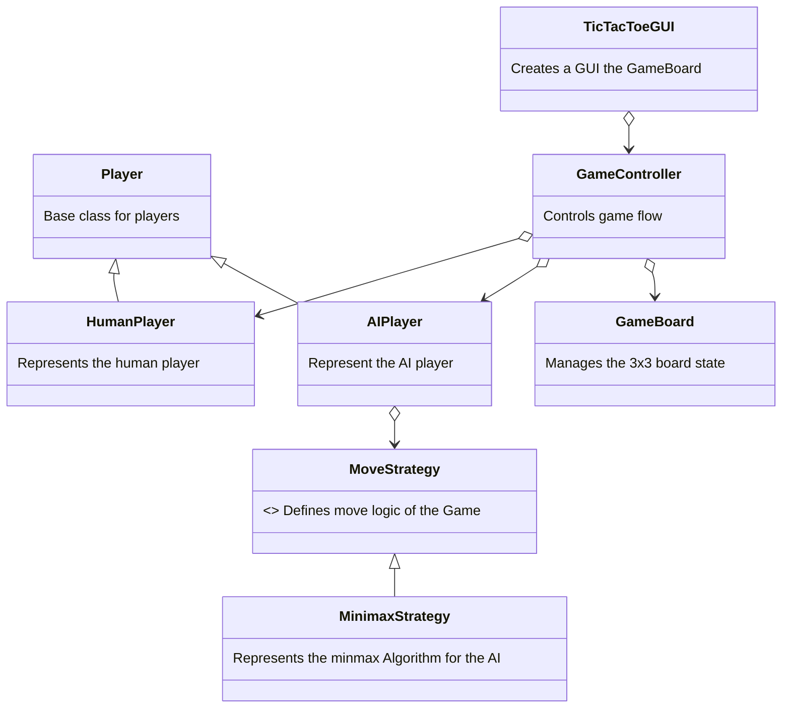

# The Tic-Tac-Toe Minmax Algorithm

Is where a human player competes in a game of Tic-Tac-Toe against an AI\
that uses the Minmax Algorithm, which is a strategy where after the first\
move is made by the human player and AI search through every possible it\
could make and chooses the best possible move. During the minmax Strategy the human\
player is known as the maximizing player, and the AI is referred to as the\
minimizing player. The score for the game is determined by the total of moves made\
(known as the depth) by both players before there's a win, loss, or draw.\

The minmax algorithm is made of classes that represents every aspect of the game\
of Tic-Tac-Toe, for the Gameboard includes function that checks if a player has won\
based on where they place there symbol on the board and checks if the cells on the\
are full.

This algorithm includes classes that inherit certain class data attributes and\
function from another class.

## The Player class
The player class represents the parent base class for\
the human player class and AI class, enabling them to\
inherit the symbol('X' or 'O') from it.

## The AI player class
The AI class represents the AI that plays against the human\
it includes the find best move function which is a function\
that uses the minmax strategy to search for the best possible\
move to make, and returns a tuple containing two ints.

## The Human Player class
The Human player class represents the human player that plays\
against the AI it includes the make move function that plays a\
symbol onto the board independently by calling the make move function\
from the Game board class, and returns a tuple containing bool and a str.

## The Gameboard class 
The Gameboard class represents a 3 by 3 2D board that the Human\
player will be playing against the AI on. It includes the make move\
function which places a symbol on the board. The is winner class,\
calls four other functions in which based on the positions symbols\
are placed on the board three in a row, col, diagonal, or anti-diagonal\
it returns True else the function would return False.

There's also the is full function checks if the Game board it includes a\
conditional statement that says if there are 0 empty cell in the board\
return True else return False.

The Game board also includes a couple of other functions, the get empty\
cells function which basically stores the cells without symbols within them\
into an empty list and returns list containing tuples with two int.

The display function which prints the board that the Human\
player will be playing against the AI on.

It includes the make_move function which places a symbol on the board.

The is_winner function calls four other functions in which based on the positions symbols\
are placed on the board three in a row, col, diagonal, or anti-diagonal\
it returns True if there was a winner else the function would return False.

There's also the is full function checks if the Game board it includes a\
conditional statement that says if there are 0 empty cell in the board\
return True else return False.

A built-in __str__ function that also prints a sketch of the board.

## The Move Strategy class
The move strategy class which is an abstract class for the AI players\
move strategy.

## The Game Controller

# Design-Pattern
# Design-Pattern
# Design-Pattern
# Design-Pattern
# Tic-Tac-Toe
